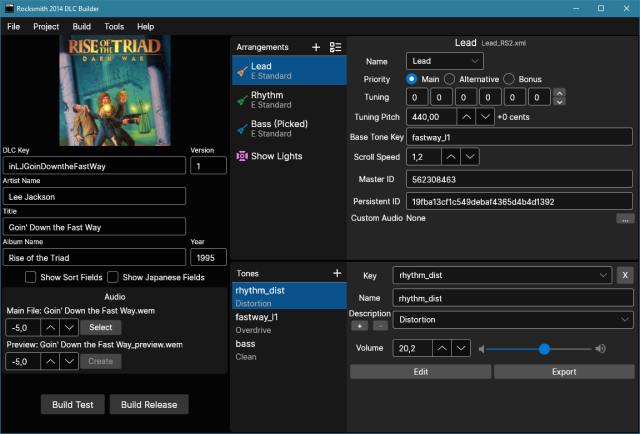

# Libraries for Rocksmith 2014 CDLC

  

.NET libraries for Rocksmith 2014 custom DLC creation. Based largely on the [Song Creator Toolkit for Rocksmith](https://github.com/rscustom/rocksmith-custom-song-toolkit).

## Samples

### DLC Builder

Cross-platform desktop app for creating CDLC.

- [More information](https://github.com/iminashi/Rocksmith2014.NET/blob/main/samples/DLCBuilder/README.md)
- [Release Notes](https://github.com/iminashi/Rocksmith2014.NET/blob/main/samples/DLCBuilder/RELEASE_NOTES.md)
- [Downloads](https://github.com/iminashi/Rocksmith2014.NET/releases)

### Misc Tools

Cross-platform desktop app mainly for testing the functionality of the libraries.

### Profile Debloater

Console app for removing obsolete IDs from profile files.

- [More information](https://github.com/iminashi/Rocksmith2014.NET/blob/main/samples/ProfileDebloater/README.md)

### Empty Title Fix

Console app for fixing empty Japanese titles in PSARCs created with a buggy version of the Toolkit.

- [More information](https://github.com/iminashi/Rocksmith2014.NET/blob/main/samples/EmptyTitleFix/README.md)

## Libraries

### Audio

Contains functionality for converting between wav, ogg and wem files, creating preview audio files and calculating volume values.

### Common

Contains various types and functions used by the other libraries. Also has functionality for reading and writing profile files.

### Conversion

Contains functionality for converting XML to SNG and vice versa.

### DD

Contains functionality for generating dynamic difficulty levels.

### DD.Model

A machine learning model for predicting level counts. Created with ML.NET model builder.

### DLCProject

Contains the Arrangement and DLCProject types and also miscellaneous functionality needed for creating CDLC (DDS conversion, showlight generation, etc.).

### EOF

Contains functionality for creating an EOF project file from Rocksmith arrangements.

### PSARC

For opening and creating PSARC archives.

### SNG

For reading and writing SNG files.

### XML

For reading, editing and writing XML files. Originally created for [DDC Improver](https://github.com/iminashi/DDCImprover).

### XML.Processing

Contains functionality for improving arrangements and checking them for errors. Ported from [DDC Improver](https://github.com/iminashi/DDCImprover).
