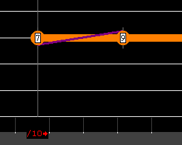
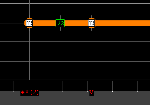
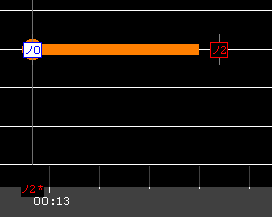
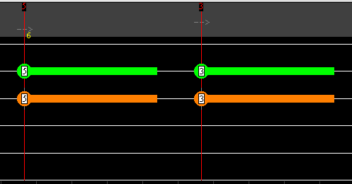
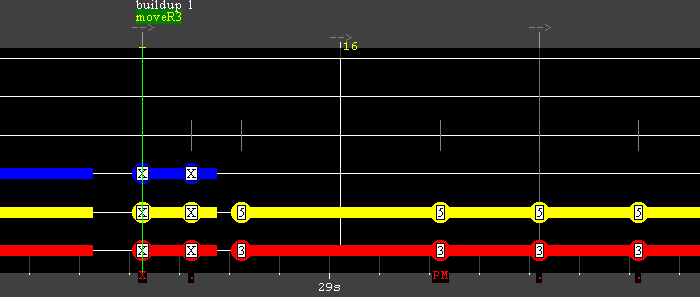
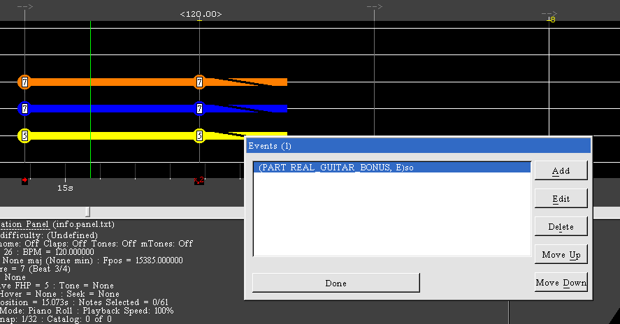

## System Requirements

A 64-bit OS:

- Windows 10 or greater with [.NET 8 runtime](https://dotnet.microsoft.com/download) installed
- macOS 10.15 or greater
- Linux: a distro that can run GUI applications created with [Avalonia](https://github.com/AvaloniaUI/Avalonia)

## Wwise

Converting audio files to wem requires Wwise 2019, 2021, 2022 or 2023 to be installed.

During the installation, check only "Authoring" in Packages and leave all Deployment Platforms and Plug-ins unchecked (unless you need them for something else).

**After the installation, you may need to run Wwise once, otherwise the automatic conversion may not work.**

On Windows the program will try to find the Wwise installation automatically using the WWISEROOT environment variable, which can be set from the Wwise Launcher, or from the default installation path in Program Files. You can also manually set the Wwise console executable path in the configuration.

On Linux, Wine is used to run the Wwise console executable. The Wwise conversion has been tested to work with Wwise 2022 files copied from a Windows installation.

## Test Build vs Release Build

### Test Build

The package for the current platform will be built into the folder specified in the configuration (creating a subfolder in the RS DLC folder is recommended). Generation of DD levels may be disabled and the App ID can be changed to a custom one.

- If RS is running, new packages will be created that have a different DLC key and arrangement IDs, with a version number in the song title. This allows you to load a new test version into the game by triggering the DLC enumeration (visit the in-game shop or via mods).
- If RS is not running, any previous test builds for the project will be replaced with a single package.

### Release Build

Will build the package(s) (both Mac and PC by default) into the project folder. DD levels will be generated if the XML files do not already have them and the App ID is hard-coded to Cherub Rock.

It is also possible in the options to define any number of target folders where the packages will be copied to after the build succeeds.

## Providing DDS Files Manually

It is possible to provide existing DDS files for the cover image (e.g. by creating them in GIMP).

For example, if the cover image file is set to cover.png, the program will search for the files cover64.dds, cover128.dds and cover256.dds, and will use any file that exists instead of doing the resizing and conversion automatically. The image sizes should be 64x64, 128x128 and 256x256.

## Arrangement Improving Features

Will be used when "Apply Improvements" is enabled.

- Fix incorrect crowd events (E0, E1, E2 -> e0, e1, e2)
- Fix chord names (Amin -> Am)
- Shorten handshapes for chord slides that include the slide-to notes
- Shorten handshapes that are too close to the next handshape
- Remove beats that come after the audio has ended
- Add crowd events (one initial crowd tempo event + intro and outro applauses) unless the arrangement already has them
- Allow moving of phrases/sections off-beat with a special phrase name "mover"
- Custom events "w3" (width 3 anchor), "removebeats", "so" (slide-out handshape)
- Linknext fret number and bend mismatches are fixed

### Automatic Fixes that Are Always Applied

These fixes will be done even if "Apply Improvements" is disabled.

- Ignore is added to 23rd and 24th fret notes, and 7th fret harmonic notes that have sustain
- Fret-hand-muted strings are removed from non-muted chords
- Anchors are created or moved to the start of each phrase
- Overlapping bend values are removed
- Sustain and linknext issues in chord notes will be fixed

## Arrangement Validation Issue Examples

### LinkNext fret mismatch for slide

A note is linked to another note, but the fret number where the slide ends does not match the fret of the next note.

### LinkNext bend mismatch

A note is linked to another note, but the bend strength the note ends with does not match the bend strength of the other note.

In the above screenshot, the second note should have a bend tech note on top of the note, or there should be a bend down.

### Note missing a bend value

A note was set as bend in EOF, but did not have any non-zero bend tech notes.

### Handshape fingering does not match anchor position

The anchor (fret hand position / FHP in EOF) fret may be incorrect when taking into account the fingering of the chord. This check is done on chords that do not use the first finger.

In the above screenshot, the first anchor should be on the 3rd fret if the double stop is played with the third finger (or 3rd and 4th finger).

## Using the Phrase Mover

Phrases can be moved off beat by giving the phrase a special name: "mover#". This feature exists to bypass a limitation in EOF.

This will move the phrase right by # notes, where the number must be 1 or more. 1 will move the phrase to the next note/chord.

Chords and split chords count as one. If the phrase is located on the same timecode as a note/chord (sustain of a previous note does not count), it counts as one.

In the above case, the phrase and section will be moved to start at the G power chord.

If an anchor (FHP) is set at the start of the phrase, it will be moved to the new position. The anchor at the old position is deleted if there is no note at that position.

## Custom Events

You can place events in EOF by selecting a beat and pressing Shift+P. Enter the event text and check "Rocksmith event marker".

### so (Slide-out Handshape)

When placed on a chord that has an unpitched slide out, an empty handshape near the end of the slide will be generated.
This will cause the fingers in the handshape to slide down or up with the slide. It is a minor effect that is sometimes used in oDLC.

If the chord is on a beat you can simply use the event "so" on that beat.
If the chord is not on a beat, you must place the event on a beat left of the target chord/notes and add a number to the event name (for example "so1").
This number specifies how many notes right of the target is from the event. It works the same as the number in "moveR" phrases.

### w3 (Anchor Zone Width 3)

This event will cause the anchor (FHP) that it is placed on, or the next anchor if there is no anchor at the event time, to have a width of three.

You can also specify a fret number in this format: "w3-22". This allows you to create an anchor at the fret 22.

### removebeats

Removes the beats starting from the beat that the event is placed on until the end.

## PSARC Quick Edit Import

The feature is meant for making quick changes to a PSARC without preserving the extracted files.
The files inside the PSARC are extracted into a temporary folder and will be deleted when editing is finished, cancelled, another project is loaded or the program is closed.
Building the package will replace the original PSARC file.

Since the process includes conversion of the arrangements into XML, there may be some differences in them compared to the original when building the package again, especially for very old or poorly made customs.
If you want to stay as close as possible to the original arrangements, disable the options "Remove DD Levels" in PSARC import and "Apply Improvements" in the build options.

## Using the Japanese Lyrics Creator Tool

The tool can be started when there is a vocals arrangement in the project.

1. Paste/enter the Japanese lyrics into the text box and they will be automatically hyphenated.
2. The matching works line by line, so you may need to edit the Japanese lyrics so that the lines match the lines of the romaji lyrics.
3. Click on the romaji syllables or the Japanese kanji/kana to combine them with the next one when necessary. Japanese words can also be split by right clicking them (or with the S key when using the keyboard).
4. Repeat this until all the lyrics are matched.

If a syllable in the original lyrics is not matched with a Japanese word, the original syllable will be used. For example, if the lyrics contain some Japanese at the beginning and the rest of them are in English, there is no need to match the English part.

## Profile Cleaner Tool

This tool is meant for removing obsolete/unnecessary records from the profile file. Such records can accumulate if you use the test build feature a lot or when you delete a CDLC that you have played.

The tool scans the DLC directory entered in the configuration for IDs of arrangements that should be preserved. This means that all official and custom DLC for which you want to preserve the records should be found in that directory or its subdirectories.

The IDs of on-disc and RS1 import songs are already included within the program.

An automatic backup file with a ".backup" extension is created in the same folder as the project file when the tool is run. You should always confirm that the profile can still be loaded after using the tool.

## Differences to the [Toolkit](https://www.rscustom.net/)

### Performance

Depending on your hardware and the project, building of packages can be 6-10 times faster compared to the Toolkit + DDC.

Memory use is more efficient. As an extreme example, building a complete discography chart: DLC Builder ~250MB vs Toolkit ~2.4GB (the 32-bit version runs out of memory). In regular use however, the DLC Builder will use more memory due to the 64-bit architecture, the UI framework used, use of memory pooling, etc.

Reading the available tones from a profile file, opening the tone editor and removing DD levels are much faster.

### Features of DLC Builder Not Available in the Toolkit

- Automatic calculation of volume values for audio
- Optional checking of the arrangements for various issues
- Creation of a preview audio file that has fade-in and fade-out similar to official files
- Per-arrangement custom audio files
- Multi-part tone descriptions with some extra options to select from
- Possibility to easily build a version of the project where the tuning is changed using a pitch shift pedal
- Tone collection for storing tones or adding an official tone into a project
- Tool for creating a Japanese vocals arrangement by matching the lyrics to a romaji arrangement
- Injection of tones into a profile file
- Profile cleaner tool
- Support for using custom fonts for both the regular lyrics and the Japanese lyrics at the same time

### Features of the Toolkit Not Available in DLC Builder

- Support for console platforms
- Support for Rocksmith 1

### Quality of Life

- Album art image is displayed in the UI
- Importing tones from the profile is more convenient
- Common hotkeys: Ctrl+N, Ctrl+O, Ctrl+S, ...
- Drag & drop files into the program window
- Remembers the five recently opened projects
- Better at opening templates created with old versions of the Toolkit than the Toolkit itself
- The UI prevents you from creating two main arrangements (represent = 1) for the same path
- Option to remove DD levels when importing a PSARC
- Option to generate an EOF project file when importing a PSARC
- Nicer looking tone editor that prevents gaps between gear slots
- Command to generate new IDs per arrangement or for all arrangements
- No arbitrary limitations on what characters can be used in artist/song names or their sort values
- The program does not stop responding while building a package
- The currently open project is not closed when the configuration is changed
- The UI is localizable into different languages

### Generated Package Minutiae

Since the Toolkit generates packages that work just fine, most of it probably does not matter, but some of the details in the generated manifest, SNG and aggregate graph files are closer to official ones.

## Differences in the DD Generator Compared to DDC

- Will not create or move phrases (there is a separate feature that creates phrases and sections for arrangements that do not have them)
- Will always generate at least two difficulty levels for any kind of phrase that has notes/chords
- Preserves anchors in noguitar sections
- Should not create cases where a note is followed by a pull-off note on the same fret/string

## External Tools Used

- [ww2ogg](https://github.com/hcs64/ww2ogg)
- [revorb](https://github.com/jonboydell/revorb-nix)
